# Bikesharing
Purpose - To visualize bike sharing data using Tableau.

## Overview of the analysis
A potential angel investor is interested in providing seed funding to explore a bike share project in Des Moines.  
To solidify the bike-sharing business proposal, bike trip analysis will be added to the proposal at the request of one of the key stakeholders.

To complete this task, Pandas will be used to change the "tripduration" column from an integer to a datetime datatype. The converted datatype will be used to create new sets of visualizations to:

- Show the length of time that bikes are checked out for all riders and genders.
- Show the number of bike trips for all riders and genders for each hour of each day of the week
- Show the number of bike trips for each type of user and gender for each day of the week.<br />

The three technical deliverables required to complete Bikesharing analysis include <br />

1. Change Trip Duration to a Datetime Format.
2. Create Visualizations for the Trip Analysis.
3. Create a Story and Report for the Final Presentation.

## Resources
- Data Source: This analysis was performed using the  [201908-citibike-tripdata.cvs](https://s3.amazonaws.com/tripdata/index.html) dataset.
-  Code: [NYC_Citibike_Challenge.ipynb](https://github.com/aobasuyi/Bikesharing/blob/main/NYC_Citibike_Challenge.ipynb) a
- Data Tools: Jupyter Notebook, CSV, Tableau and IO (Web Server)
- Software: Jupyter Notebook and Visual Studio Code 1.50.0


### Deliverable 1

#### Change Trip Duration to a Datetime Format <br />
- Using Python and Pandas functions, convert the "tripduration" column from an integer to a datetime datatype to get the time in hours, minutes, and seconds (00:00:00). 
- Convert the "tripduration" column to a datetime dataytpe, then export the DataFrame as a CSV file to use for the trip analysis

```
# Files to load
CitiBike_data_to_load = "201908-citibike-tripdata.csv"

# 1. Create a DataFrame for the 201908-citibike-tripdata data. 
CitiBike_df = pd.read_csv(CitiBike_data_to_load)
CitiBike_df.head()

# 2. Check the datatypes of your columns. 
CitiBike_df.dtypes

# 3. Convert the 'tripduration' column to datetime datatype.
CitiBike_df['tripduration_orig'] =CitiBike_df['tripduration']
CitiBike_df["tripduration"] = pd.to_datetime(CitiBike_df["tripduration"], unit='s')  

# 4. Check the datatypes of your columns. 
CitiBike_df.info()

# 5a. Create the output File (CSV)
output_data_file = "NewYork_CitiBike.csv"

# 5b. Export the Dataframe as a new CSV file without the index.
CitiBike_df.to_csv(output_data_file, index=False)

```

## Results
- Using the visualizations in Tableau Story, describe the results of each visualization underneath the image.

### Deliverable 2
 <br />

#### Create Visualizations for the Trip Analysis <br />

a). How long bikes are checked out for all riders and genders.

<br /> 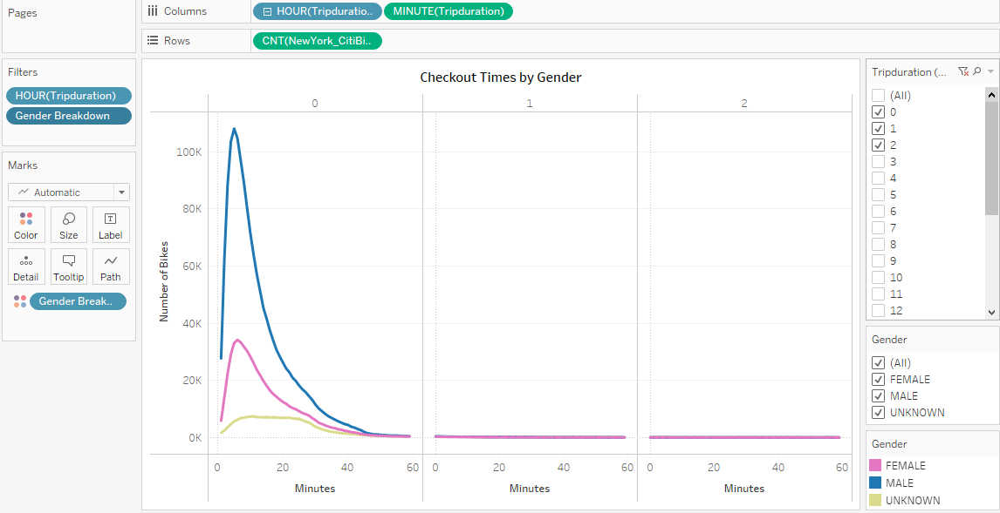 <br />

<br /> 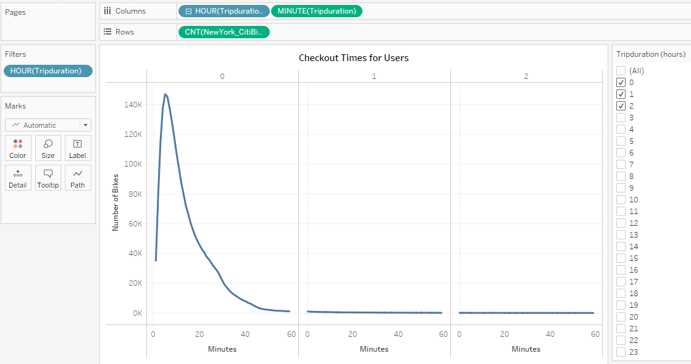 <br />

- Most Citi bike trips lasted less than one hour with the highest bike ride lasting about 6 minutes. Males were 3 times more likely that than females to use bike rideshare .<br />  <br />

b).  How many trips are taken by the hour for each day of the week, for all riders and genders.

<br /> 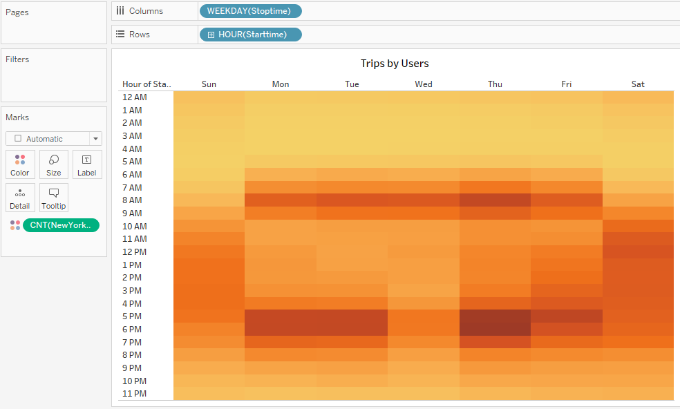 <br />

<br /> 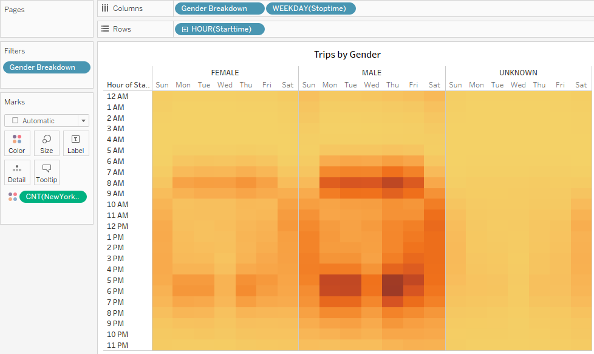 <br />

- Users are most likely to bike rideshare between 5 and 6 pm on weekdays except for Wednesdays. Saturdays peak hours start at 10 and lasts thorugh 7pm.
- Males are more likely that than females to use bike rideshare on weekdays.
<br />
c.) A breakdown of what days of the week a user might be more likely to check out a bike, by type of user and gender.

<br /> 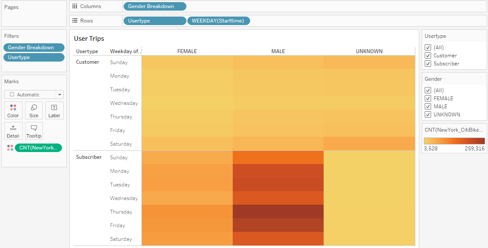 <br />

- Male subscribers are more likey to use the ride bikeshare on weekdays.
- Unknown customers use ride bikeshare the most on Saturdays.
<br />

### Deliverable 3
 <br />

#### Create a Story and Report for the Final Presentation <br />

- Create a story in Tableau and write a report that describes the key outcomes of the NYC Citibike analysis.
- Click this link to access the NYC Citibike analysis [NYC Citibike analysis dashboard](https://public.tableau.com/app/profile/pat1796/viz/DesMoinesCitiBikeProposal_16274868652750/CitiBikeProposal?publish=yes) 

- Overview
<br /> 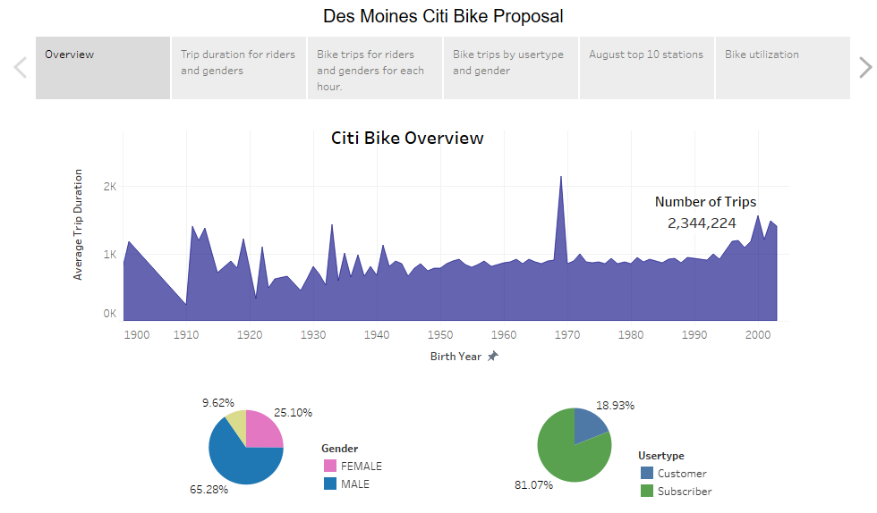 <br />

- The CitiBike ridesharing average trip duration has been insceraing steadily since 1990. A typical citi bikeshare user is a male subscriber.

- Checkout Times

<br /> 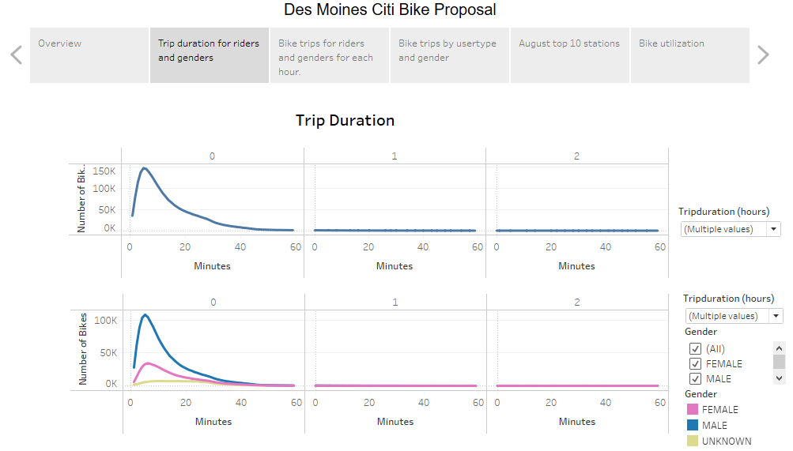 <br />

- Male users are more likely to use the bike rideshare for a trip lasting less than 40 minutes

- Weekday by hour

<br /> 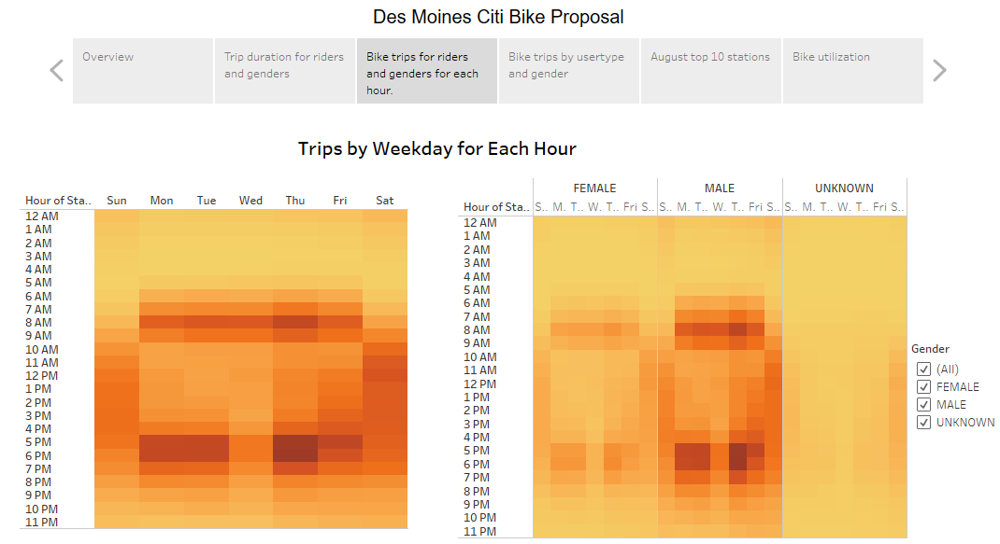 <br />

- Citi bike rideshare peak hours are 8 am, 5pm and 6 pm on weekdays except for Saturdays. Males are most likely to use the bike rideshare

 - Usertype and gender
<br /> 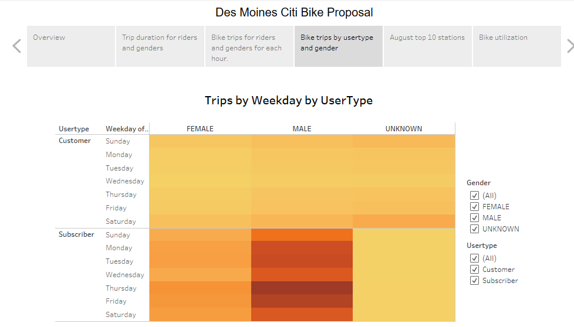 <br />

- Male subcribers are most likely to use bike rideshare on weekdays.

- Top 10 stations
<br /> 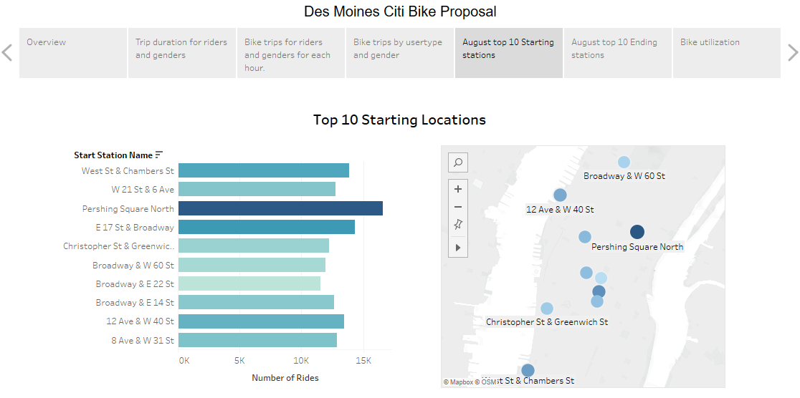 <br />

- Pershing Square North is the top starting station at 
<br /> 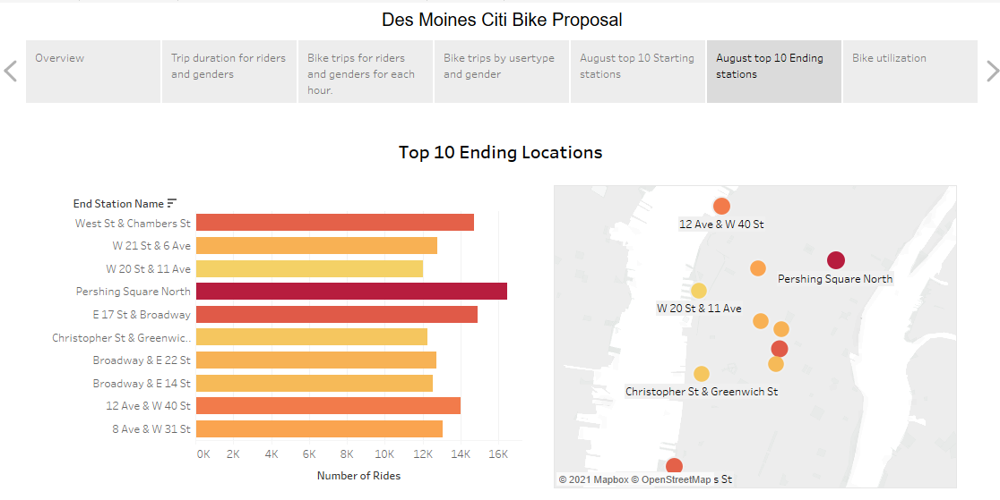 <br />

| Top 10 starting stations  | Top 10 ending stations |
| ------------- | ------------- |
|   |  |


- Pershing Square North is teh top starting and ending station 

- Average Bike Utilization

<br /> 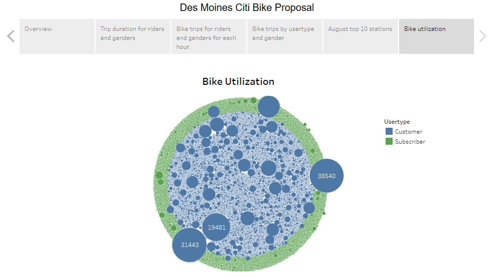 <br />

- Bike utilization by customsers are hignest for bike IDs 

## Summary:
- The average trip duration for bike ridesharing has steadily increased since 1990s.
Male subscribers are most likely to use citi Bike rideshare on for each hour and weekdays.
- Two additional visualizations suggested for future analysis include
 - Predict the average trip utilization for the next five years
 - Determine top starting and stopping station by a.) usertype amd b.) gender to find ways to increase bike sharing use by both groups.


